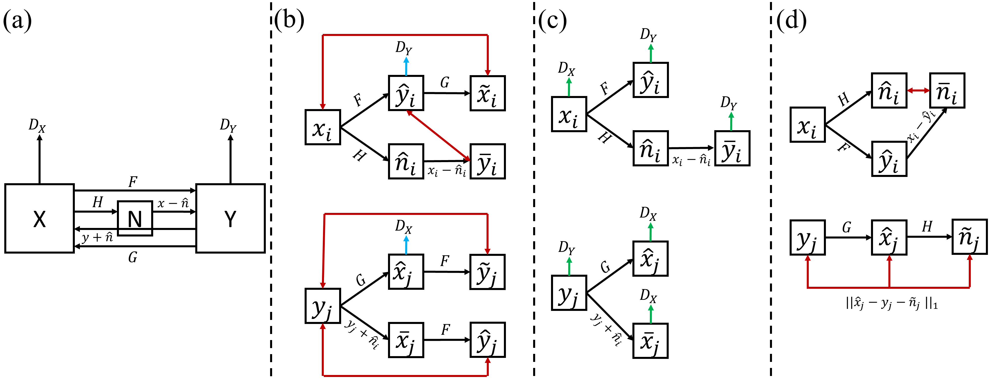
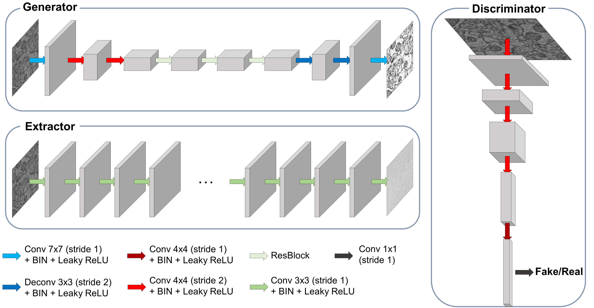

# ISCL: Interdependent Self-Cooperative Learning for Unpaired Image Denoising #
This is an official tensorflow implementation of the [paper](https://ieeexplore.ieee.org/document/9478781) by [Kanggeun Lee](https://scholar.google.com/citations?hl=ko&user=OvRs1iwAAAAJ) and [Won-Ki Jeong](https://scholar.google.com/citations?hl=ko&user=bnyKqkwAAAAJ).

**IEEE Transactions on Medical Imaging**

- With the advent of advances in self-supervised learning, paired clean-noisy data are no longer required in deep learning-based image denoising. However, existing blind denoising methods still require the assumption with regard to noise characteristics, such as zero-mean noise distribution and pixel-wise noise-signal independence; this hinders wide adaptation of the method in the medical domain. On the other hand, unpaired learning can overcome limitations related to the assumption on noise characteristics, which makes it more feasible for collecting the training data in real-world scenarios. 
In this paper, **we propose a novel image denoising scheme, Interdependent Self-Cooperative Learning (ISCL), that leverages unpaired learning by combining cyclic adversarial learning with self-supervised residual learning**. Unlike the existing unpaired image denoising methods relying on matching data distributions in different domains, the two architectures in ISCL, designed for different tasks, complement each other and boost the learning process. To assess the performance of the proposed method, we conducted extensive experiments in various biomedical image degradation scenarios, such as noise caused by physical characteristics of electron microscopy (EM) devices (film and charging noise), and structural noise found in low-dose computer tomography (CT). We demonstrate that the image quality of our method is superior to conventional and current state-of-the-art deep learning-based unpaired image denoising methods. 

### **Network Architecture** ###


### **Qualitative Results** ###
- Qualitative performance on losw-dose CT data.

- Qualitative performance on synthetic charge noise and film noise simulations.

- Qualitative performance on real EM images corrupted with complex heterogeneous noise (i.e., charge noise and film noise) without paired clean ground truth images.

## **Environment Setup** ## 
- Build docker image 
```
cd docker
./build.sh
```
- After download the dataset from this [link](data/README.md), you need to change the absolute path in the script 'demo.sh'.
```
docker run --gpus '"device=0"' --rm -v /home:/home -ti ISCL:2.5.0 python absolute_path/demo_EM.py --iter=400 --epoch=20 --batch_size=64 --lr=1e-4 --kfold=4 \
--clean_data='add an absolute path' \
--noisy_data='add an absolute path' \
--result_dir='add an absolute path'
```
- You can test the demo of cross-validation for the synthetic noisy EM denoising. 
```
cd scripts
./demo.sh
```
- If you want to utilize multiple GPUs, then you should modify the device argument in the 'demo.sh' script.
```
docker run --gpus '"device=0,1,2,3"' ~~
```

## **Citation** ##

This article has been accepted for publication in IEEE Transactions on  Medical  Imaging. This is the author’s version which has not beenfully edited and content may change prior to final publication.
```
@article{Lee_2021,
	doi = {10.1109/tmi.2021.3096142},
	url = {https://doi.org/10.1109/TMI.2021.3096142},
	year = 2021,
	publisher = {Institute of Electrical and Electronics Engineers ({IEEE})},
	pages = {1--1},
	author = {Kanggeun Lee and Won-Ki Jeong},
	title = {{ISCL}: Interdependent Self-Cooperative Learning for Unpaired Image Denoising},
	journal = {{IEEE} Transactions on Medical Imaging}
}
```
